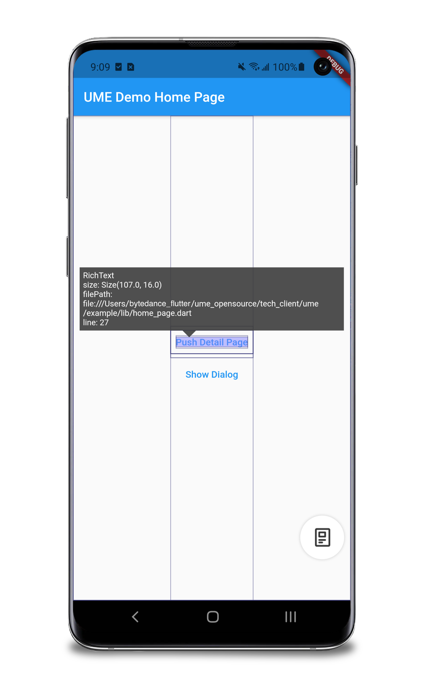
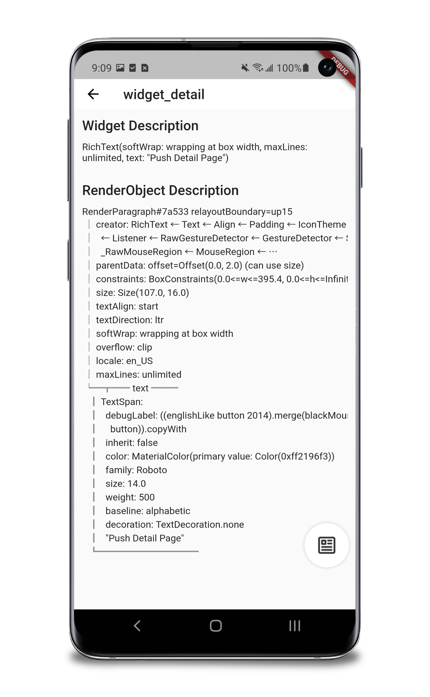
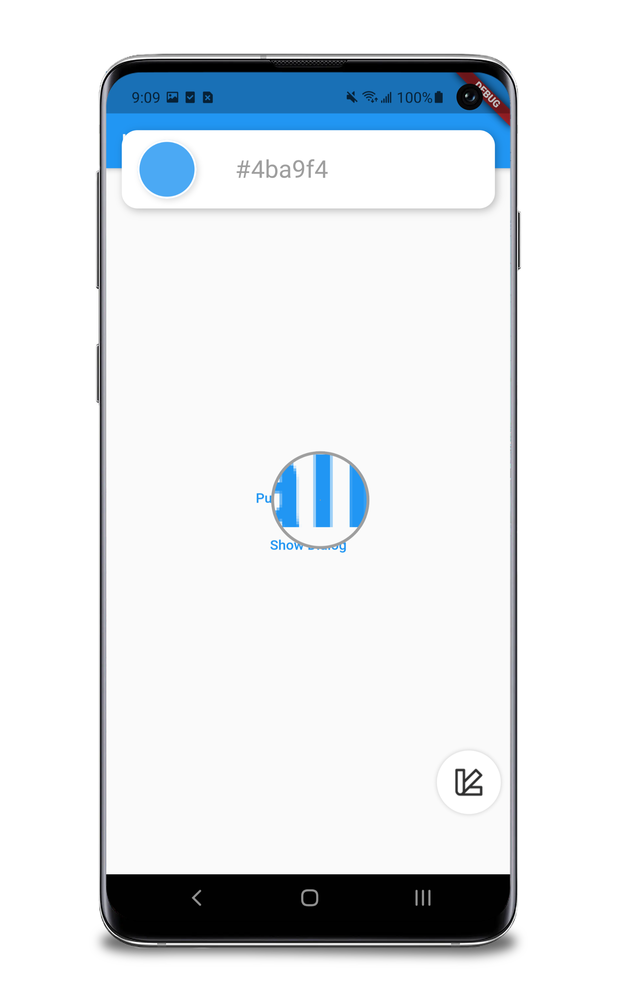
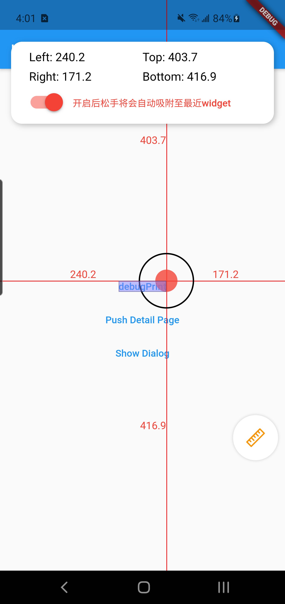
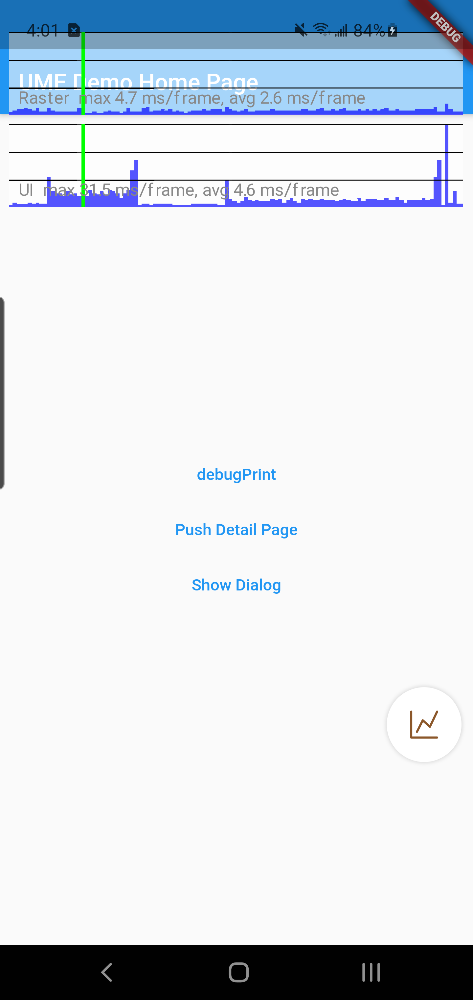
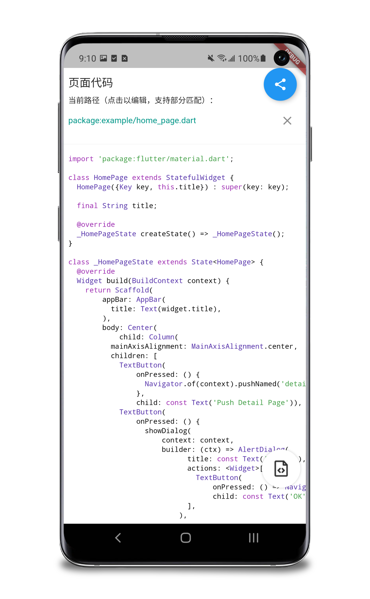
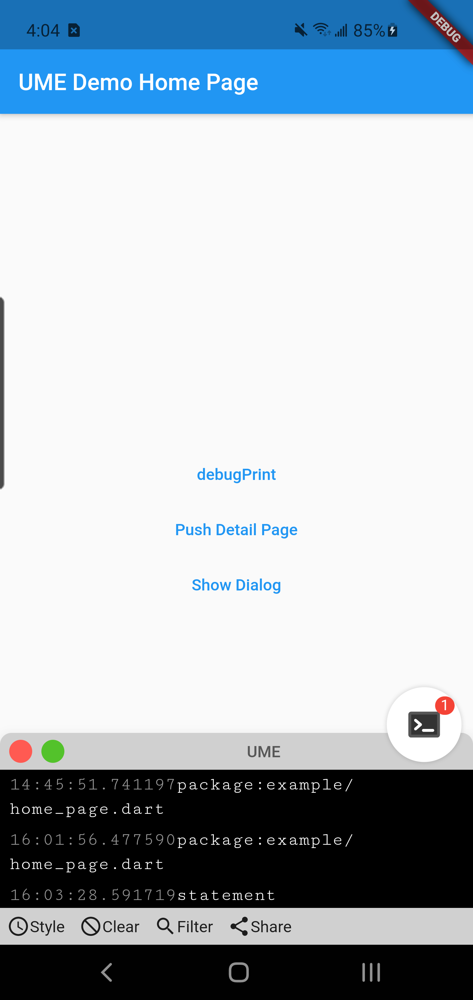
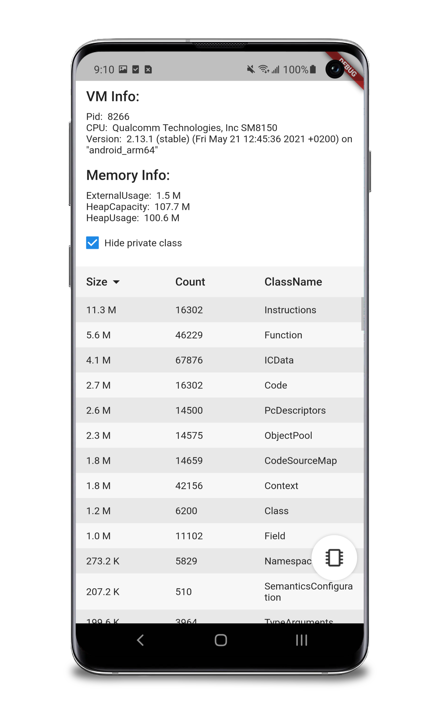
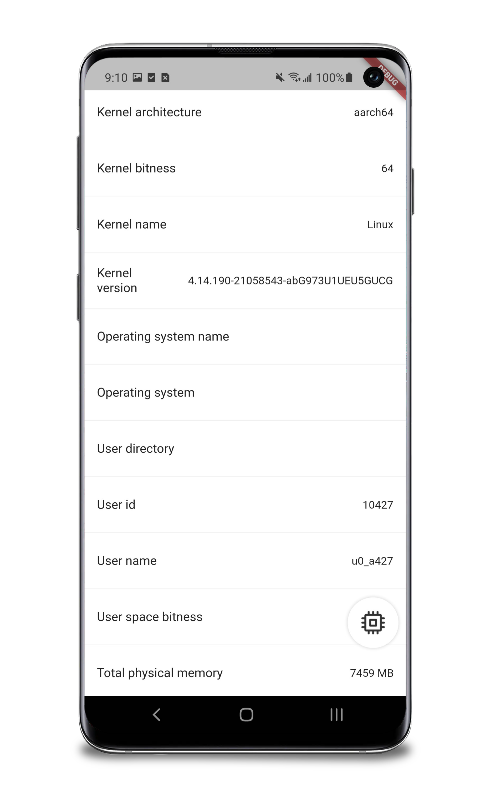
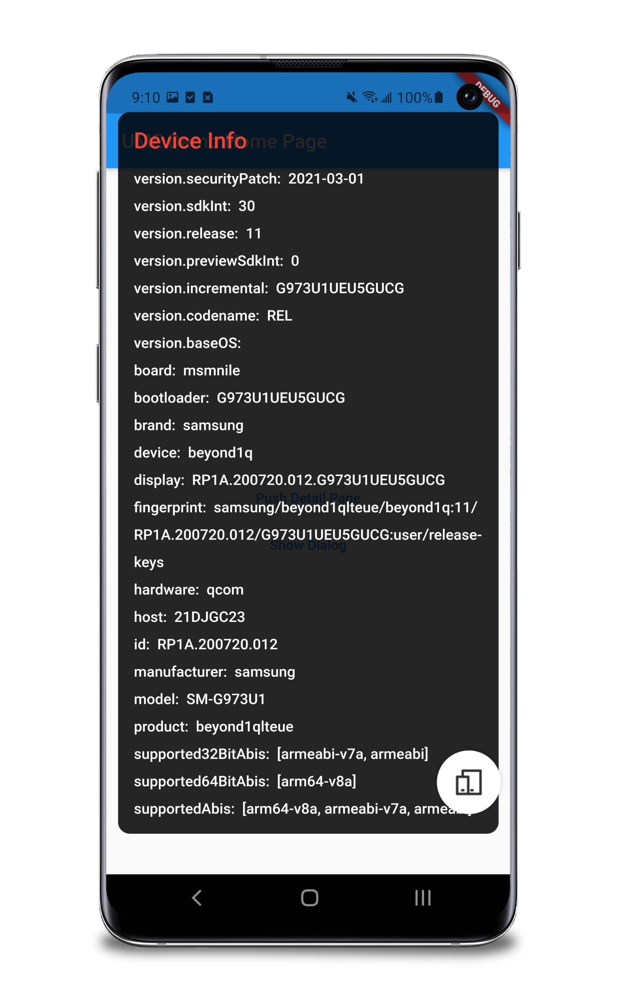

# flutter_ume

[English](./README_en.md)

Flutter 应用内调试工具平台


扫码或点击链接下载 apk，快速体验 UME。
https://github.com/bytedance/flutter_ume/releases/download/v0.1.0.4/app-debug.apk

当前版本内置 10 个插件，
开发者可以创建自己的插件，并集成进 UME 平台。
详见本文[为 UME 开发插件](#为-ume-开发插件)部分。

- [flutter_ume](#flutter_ume)
  - [快速接入](#快速接入)
  - [特别说明](#特别说明)
  - [功能介绍](#功能介绍)
  - [为 UME 开发插件](#为-ume-开发插件)
  - [版本说明](#版本说明)
    - [兼容性](#兼容性)
    - [单测覆盖率](#单测覆盖率)
    - [版本号规则](#版本号规则)
    - [Null-safety 版本](#null-safety-版本)
    - [更新日志](#更新日志)
  - [如何贡献](#如何贡献)
  - [开源协议](#开源协议)
  - [联系开发者](#联系开发者)

## 快速接入

1. 修改 `pubspec.yaml`，添加依赖

    ``` yaml
    dev_dependencies: # 请不要在 release 环境下使用 UME
      flutter_ume: ^0.1.0  # null-safety 版本: ^0.2.0-dev.0
      flutter_ume_kit_ui: ^0.1.0  # null-safety 版本: ^0.2.0-dev.0
      flutter_ume_kit_device: ^0.1.0  # null-safety 版本: ^0.2.0-dev.0
      flutter_ume_kit_perf: ^0.1.0  # null-safety 版本: ^0.2.0-dev.0
      flutter_ume_kit_show_code: ^0.1.0  # null-safety 版本: ^0.2.0-dev.0
      flutter_ume_kit_console: ^0.1.0  # null-safety 版本: ^0.2.0-dev.0
    ```

2. 执行 `flutter pub get`
3. 引入包

    ``` dart
    import 'package:flutter_ume/flutter_ume.dart'; // UME 框架
    import 'package:flutter_ume_kit_ui/flutter_ume_kit_ui.dart'; // UI 插件包
    import 'package:flutter_ume_kit_perf/flutter_ume_kit_perf.dart'; // 性能插件包
    import 'package:flutter_ume_kit_show_code/flutter_ume_kit_show_code.dart'; // 代码查看插件包
    import 'package:flutter_ume_kit_device/flutter_ume_kit_device.dart'; // 设备信息插件包
    import 'package:flutter_ume_kit_console/flutter_ume_kit_console.dart'; // debugPrint 插件包
    ```

4. 修改程序入口，增加初始化方法及注册插件代码

    ``` dart
    void main() {
      if (kDebugMode) {
        PluginManager.instance                                 // 注册插件
          ..register(WidgetInfoInspector())
          ..register(WidgetDetailInspector())
          ..register(ColorSucker())
          ..register(AlignRuler())
          ..register(Performance())
          ..register(ShowCode())
          ..register(MemoryInfoPage())
          ..register(CpuInfoPage())
          ..register(DeviceInfoPanel())
          ..register(Console());
        runApp(injectUMEWidget(child: MyApp(), enable: true)); // 初始化
      } else {
        runApp(MyApp());
      }
    }
    ```

5. `flutter run` 运行代码
   或 `flutter build apk --debug`、`flutter build ios --debug` 构建产物

  > 部分功能依赖 VM Service，本地运行需要添加额外参数，以确保能够连接到 VM Service。
  >
  > Flutter 2.0.x、2.2.x 等版本在真机上运行，`flutter run` 需要添加 `--disable-dds` 参数。
  > 在 [Pull Request #80900](https://github.com/flutter/flutter/pull/80900) 合入之后，`--disable-dds` 参数被更名为 `--no-dds`。

## 特别说明

由于 UME 在顶层管理了路由栈，`showDialog` 等方法默认使用 `rootNavigator` 弹出，
所以**必须**在 `showDialog`、`showGeneralDialog` 等弹窗方法，传入参数 `useRootNavigator: false` 避免路由栈错误。

``` dart
showDialog(
  context: context,
  builder: (ctx) => AlertDialog(
        title: const Text('Dialog'),
        actions: <Widget>[
          TextButton(
              onPressed: () => Navigator.pop(context),
              child: const Text('OK'))
        ],
      ),
  useRootNavigator: false); // <===== 非常重要
```

## 功能介绍

当前开源版 UME 内置了 10 个插件

<table border="1" width="100%">
    <tr>
        <td width="33.33%" align="center"></br>Widget 信息</td>
        <td width="33.33%" align="center"></br>Widget 详情</td>
        <td width="33.33%" align="center"></br>颜色吸管</td>
    </tr>
    <tr>
        <td width="33.33%" align="center"></br>对齐标尺</td>
        <td width="33.33%" align="center"></br>性能浮层</td>
        <td width="33.33%" align="center"></br>代码查看</td>
    </tr>
    <tr>
        <td width="33.33%" align="center"></br>日志展示</td>
        <td width="33.33%" align="center"></br>内存信息</td>
        <td width="33.33%" align="center"></br>CPU 信息</td>
    </tr>
    <tr>
        <td width="33.33%" align="center"></br>设备信息</td>
    </tr>
</table>

## 为 UME 开发插件

> UME 插件位于 `./kits` 目录下，每个插件包都是一个 `package`
> 本小节示例可参考 [`./custom_plugin_example`](./custom_plugin_example/)

1. `flutter create -t package custom_plugin` 创建一个插件包，可以是 `package`，也可以是 `plugin`
2. 修改插件包的 `pubspec.yaml`，添加依赖

    ``` yaml
    dependencies:
      flutter_ume: '>=0.1.0 <0.2.0'
    ```

3. 创建插件配置，实现 `Pluggable` 虚类

    ``` dart
    import 'package:flutter_ume/flutter_ume.dart';

    class CustomPlugin implements Pluggable {
      CustomPlugin({Key key});

      @override
      Widget buildWidget(BuildContext context) => Container(
        color: Colors.white
        width: 100,
        height: 100,
        child: Center(
          child: Text('Custom Plugin')
        ),
      ); // 返回插件面板

      @override
      String get name => 'CustomPlugin'; // 插件名称

      @override
      String get displayName => 'CustomPlugin';

      @override
      void onTrigger() {} // 点击插件面板图标时调用

      @override
      ImageProvider<Object> get iconImageProvider => NetworkImage('url'); // 插件图标
    }
    ```

4. 在工程中引入自定义插件

    1. 修改 `pubspec.yaml`，添加依赖

        ``` yaml
        dev_dependencies:
          custom_plugin:
            path: path/to/custom_plugin
        ```

    2. 执行 `flutter pub get`

    3. 引入包

        ``` dart
        import 'package:custom_plugin/custom_plugin.dart';
        ```

5. 在工程中注册插件

    ``` dart
    if (kDebugMode) {
      PluginManager.instance
        ..register(CustomPlugin());
      runApp(
        injectUMEWidget(
          child: MyApp(), 
          enable: true
        )
      );
    } else {
      runApp(MyApp());
    }
    ```

6. 运行代码

## 版本说明

### 兼容性

| UME 版本 | Flutter 1.12.13 | Flutter 1.22.3 | Flutter 2.0.1 | Flutter 2.2.3 |
| ---- | ---- | ---- | ---- | ---- |
| 0.1.0 | ✅ | ✅ | ✅ | ✅ |
| 0.2.0-dev.0 | ❌ | ❌ | ✅ | ✅ |

### 单测覆盖率

| 包 | master | develop | develop_nullsafety |
| ---- | ---- | ---- | ---- |
| flutter_ume |  |  |  |
| flutter_ume_kit_device |  |  |  |
| flutter_ume_kit_perf |  |  |  |
| flutter_ume_kit_show_code |  |  |  |
| flutter_ume_kit_ui |  |  |  |
| flutter_ume_kit_console |  |  |  |

### 版本号规则

请参考 [Semantic versions](https://dart.dev/tools/pub/versioning#semantic-versions)

### Null-safety 版本

| 包 | null-safety 推荐版本号 |
| ---- | ---- |
| flutter_ume | 0.2.0-dev.0 |
| flutter_ume_kit_ui | 0.2.0-dev.0 |
| flutter_ume_kit_device | 0.2.0-dev.0 |
| flutter_ume_kit_perf | 0.2.0-dev.0 |
| flutter_ume_kit_show_code | 0.2.0-dev.0 |
| flutter_ume_kit_console | 0.2.0-dev.0 |

### 更新日志

[Changelog](./CHANGELOG.md)

## 如何贡献

[Contributing](./CONTRIBUTING.md)

## 开源协议

该项目遵循 MIT 协议，详情请见 [LICENSE](./LICENSE)。

## 联系开发者

**可能你：**

- 发现文档错误、代码有 bug
- 使用 UME 后应用运行产生异常
- 发现新版本 Flutter 无法兼容
- 有好的点子或产品建议

上述情况均可以[提一个 issue](./CONTRIBUTING.md#如何提-issue)。

**可能你：**

- 想与开发者交流
- 想与更多 Flutter 开发者交流
- 想与 UME 开展交流或合作

欢迎[加入字节跳动 Flutter 交流群](https://applink.feishu.cn/client/chat/chatter/add_by_link?link_token=67au2f75-3783-41b0-8868-0fc0178f1fd8)

或随时[联系开发者](mailto:zhaorui.dev@bytedance.com)
